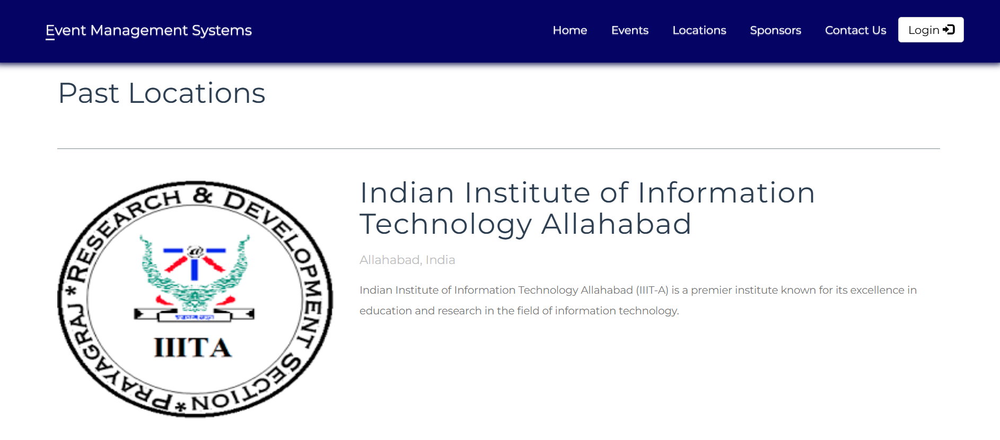

# Event Management System

A modern web application to organize, manage, and promote events with ease. This system streamlines event creation, attendee registration, sponsor management, and more—ideal for conferences, workshops, social gatherings, and public events.

---

## 🚀 Live Demo

🌐 **Try the Website Live!** [visit website](https://inizio-dsqw.onrender.com/)
---

## 🖼️ Screenshots

**Homepage**


**Event Page**


**Event Register**


**Location Page**


**Admin Dashboard**

---

## ✨ Features
- **Event Management:** Create, edit, and delete events with detailed information.
- **Attendee Registration:** Easy sign-up and management for event participants.
- **Sponsor Integration:** Add and manage sponsors for public events.
- **Location Management:** Organize events by location with full CRUD support.
- **Download Attendees:** Export attendee lists for event management.
- **User Roles:** Admin, Organizer, and User dashboards with role-based access.
- **Public Event Display:** Browse and search events as a guest.
- **User Authentication:** Secure login and registration for users.
- **Responsive Design:** Clean, mobile-friendly interface using Bootstrap.

---

## 🛠️ Getting Started

### Prerequisites
- PHP 7.4+
- MySQL
- Composer
- Web server (e.g., XAMPP, Apache, mysql)

### Installation
1. **Clone the repository:**
   ```bash
   git clone https://github.com/SimaranMaurya007/Inizio.git
   cd eventManagementSystem
   ```
2. **Install dependencies:**
   ```bash
   composer install
   ```
3. **Set up the database:**
   - Import the SQL files from the `sql/` directory into your MySQL server.
   - Update database credentials in `classes/Connection.php` if needed.
4. **Run the application:**
   - Start your web server and navigate to the project directory in your browser (e.g., `http://localhost/eventManagementSystem`).

---

## 📦 Project Structure
- `classes/` — PHP classes for events, locations, sponsors, users, and database access
- `css/` & `js/` — Frontend assets (Bootstrap, custom styles, scripts)
- `utils/` — Reusable UI components (header, footer, toolbar, etc.)
- `sql/` — Database schema and sample data
- `images/` — Event and sponsor images

---

